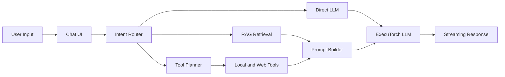

# OfflineMate Functionality Improvement Roadmap

## Current Shape

OfflineMate already has a strong baseline: Expo/React Native app shell, onboarding, tiered on-device LLM loading through `react-native-executorch`, local notes, RAG/vector search, planner-driven tools, voice input/output, web-search toggle, and Android release automation.

Core flow:

Key files reviewed include:

- [`app/(tabs)/chat.tsx`](../app/(tabs)/chat.tsx)
- [`src/hooks/useLLMChat.ts`](../src/hooks/useLLMChat.ts)
- [`src/ai/llm-engine.ts`](../src/ai/llm-engine.ts)
- [`src/ai/model-registry.ts`](../src/ai/model-registry.ts)
- [`src/context/vector-store.ts`](../src/context/vector-store.ts)
- [`src/ai/agent-planner.ts`](../src/ai/agent-planner.ts)
- [`app/onboarding.tsx`](../app/onboarding.tsx)
- [`app/(tabs)/settings.tsx`](../app/(tabs)/settings.tsx)
- [`docs/ROADMAP_AND_GAPS.md`](./ROADMAP_AND_GAPS.md)
- [`package.json`](../package.json)

## Recommended Priorities

1. Product readiness and trust:

- Add a model-asset readiness preflight before chat generation, with clear recovery to onboarding/download.
- Clarify privacy/network behavior in onboarding and settings: model downloads, optional web search, and OS TTS are the main non-local boundaries.
- Add optional persisted chat with retention limit, manual clear, and privacy-first default copy.

2. UX improvements:

- Make onboarding download state more explicit: setup should clearly say whether chat is usable, which assets are downloaded, and what happens if the user continues early.
- Rename or explain `Voice replies` so users understand it controls TTS, while the microphone controls STT.
- Upgrade the Tools tab from a developer registry into a user-facing capabilities screen with examples like "Set a reminder", "Search my notes", and "Find a contact".
- Add note edit/detail/search flows; current notes are create/list/delete only.

3. AI/runtime reliability:

- Surface embedding health when fallback vectors are used, because fake deterministic vectors can make RAG appear healthy while retrieval quality is poor.
- Improve retrieval ranking with source diversity and metadata filters.
- Tighten planner output handling with stronger schema repair/fallback and user-visible disambiguation for ambiguous tool vs memory requests.
- Consider built-in model alternates in the UI, since the registry already has `primary` and `alternates` but users can only choose tiers.

4. Performance and device resilience:

- Add dynamic token/context budgets based on device memory, thermal state, and model tier.
- Put a stronger cap or maintenance policy around legacy vector scan fallback when `sqlite-vec` is unavailable.
- Add local diagnostic traces for init, download, retrieval, planner, and generation timing.

5. Quality and release engineering:

- Bring Android release workflow closer to CI by running e2e/perf/audit before EAS build, or explicitly document the intentional subset.
- Add `npx expo-doctor` to PR CI so release config drift is caught earlier.
- Add real emulator/device E2E for onboarding, permissions, model download, voice, and native runtime smoke flows.
- Consider coverage thresholds and a format check if the project wants stricter consistency.

## Suggested First Implementation Batch

Start with a small, high-confidence batch that directly improves user trust and reduces support burden:

- Model asset preflight in [`src/hooks/useLLMChat.ts`](../src/hooks/useLLMChat.ts) and/or [`src/ai/model-manager.ts`](../src/ai/model-manager.ts).
- Clearer onboarding/download copy in [`app/onboarding.tsx`](../app/onboarding.tsx) and [`src/components/ModelDownloader.tsx`](../src/components/ModelDownloader.tsx).
- Privacy/network explanation in [`app/(tabs)/settings.tsx`](../app/(tabs)/settings.tsx).
- Release workflow parity updates in [`.github/workflows/release-android.yml`](../.github/workflows/release-android.yml) and CI doctor check in [`.github/workflows/ci.yml`](../.github/workflows/ci.yml).

This batch is low-risk, aligns with existing roadmap notes, and gives immediate improvement before deeper planner/RAG/model-selection changes.

## Work Items

- Design and implement model-asset readiness preflight before chat generation with actionable recovery UI.
- Clarify onboarding/settings copy for local-only behavior, model downloads, optional web search, STT, and TTS boundaries.
- Add optional persisted chat history with retention and manual clear controls.
- Improve Tools and Notes screens into user-facing capability and knowledge-management flows.
- Add embedding health surfacing, source-diverse retrieval, and stricter planner fallback/repair behavior.
- Align release workflow with CI gates and add Expo Doctor/device-level smoke coverage.
