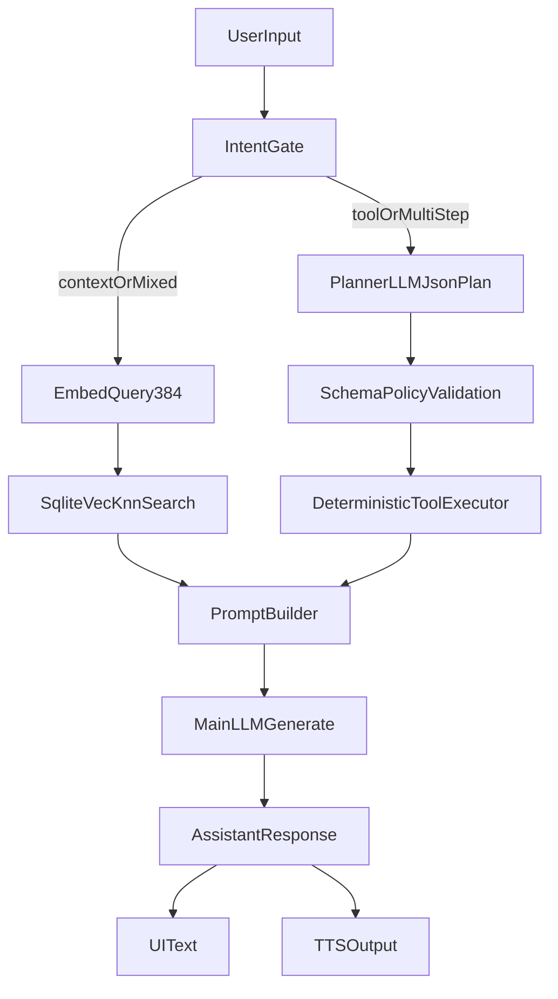

# Input Processing and Tooling Flow

This document defines how OfflineMate processes user input efficiently on-device. It is the main reference for **how processing is done** from user message to assistant response. For **in-depth technical detail** (STT technology and parameters, embedding math, vector search, RAG science, planner, validation, execution), see **`tech/processing-pipeline-in-depth.md`**.

## How Processing Is Done (Step-by-Step)

When the user sends a message (text or voice), the following happens in order:

1. **Input**
   - Text: message is used as-is.
   - Voice: the mic records while the user holds the button; on release, Whisper `RealtimeTranscriber` (with Silero VAD when available) transcribes to text. That text becomes the message.

2. **Intent routing** (`intent-router`)
   - The message is classified as **direct**, **context**, or **tool** using keyword rules (no LLM).
   - **Tool** is chosen if tool-related keywords (e.g. remind, schedule, call, note) match first; **context** if context keywords (e.g. remember, recall, what did I) match; otherwise **direct**.

3. **Context path** (if intent is *context*)
   - The message is embedded (ExecuTorch, 384-d).
   - Vector search (sqlite-vec KNN) returns top-k relevant chunks from indexed notes/memory.
   - Snippets are passed to the prompt builder as context.

4. **Tool path** (if intent is *tool* or multi-step)
   - A **planner** LLM call produces a JSON plan: list of steps with `toolName` and `args`.
   - Plan is validated (schema, allow-list tools, sanitized args).
   - If invalid, a fallback plan is built from keywords (e.g. single step for “remind me…”).
   - **Executor** runs each step in order: looks up the tool in the registry, runs it with the given args (plus query/text), and collects results.
   - Tool result summary (and optional plan summary) is passed to the prompt builder.

5. **Prompt build**
   - System prompt, conversation history, any context snippets, and any tool result are combined into the messages sent to the main LLM.

6. **Main LLM**
   - The selected tier’s model (ExecuTorch) is loaded if needed.
   - Generation runs with tier-specific config (temperature, top-p). Tokens are streamed; `<think>` blocks are parsed for the “thinking” UI; the rest is the reply.
   - Repetition detection can interrupt generation; output is cleaned (repeated lines/tails removed). Planner JSON leaks are replaced with a short tool summary when applicable.

7. **Response**
   - Final text is shown in the chat and optionally spoken (TTS). The message (and any thinking lines) is stored in the chat store.

All of this runs on-device: no user content is sent to the cloud for inference or retrieval.

## Core Processing Flow (Implemented)

## Why This Flow Was Chosen

- Separates intent gating, retrieval, planning, and generation for lower latency and better debuggability.
- Uses native vector KNN (`sqlite-vec`) to reduce JS-side scan overhead.
- Uses planner schema validation to avoid malformed tool execution.
- Preserves deterministic fallback paths when planner/vector capabilities are unavailable.

## Input Modes

- Text input
- Voice input (STT before routing)
- Image input (future phase)

## Intent Routing Strategy

Early phase:

- Rule-based classification (keywords, command patterns)
- No extra LLM call for routing on weaker devices

Current phase:

- LLM-assisted JSON planner for tool/multi-step flows
- deterministic validation + executor
- fallback deterministic plan when planner output is invalid

## Tooling Design

- Tool registry with strict allow-list
- Schema-validated arguments for each tool
- Minimal output shape returned to prompt builder

Initial tool set:

- calendar read/create
- contacts search
- notes create/search
- reminders set

## References

- Expo Calendar: [https://docs.expo.dev/versions/latest/sdk/calendar/](https://docs.expo.dev/versions/latest/sdk/calendar/)
- Expo Contacts: [https://docs.expo.dev/versions/latest/sdk/contacts/](https://docs.expo.dev/versions/latest/sdk/contacts/)
- Expo Notifications: [https://docs.expo.dev/versions/latest/sdk/notifications/](https://docs.expo.dev/versions/latest/sdk/notifications/)
- React Native RAG concepts: [https://software-mansion-labs.github.io/react-native-rag/](https://software-mansion-labs.github.io/react-native-rag/)
