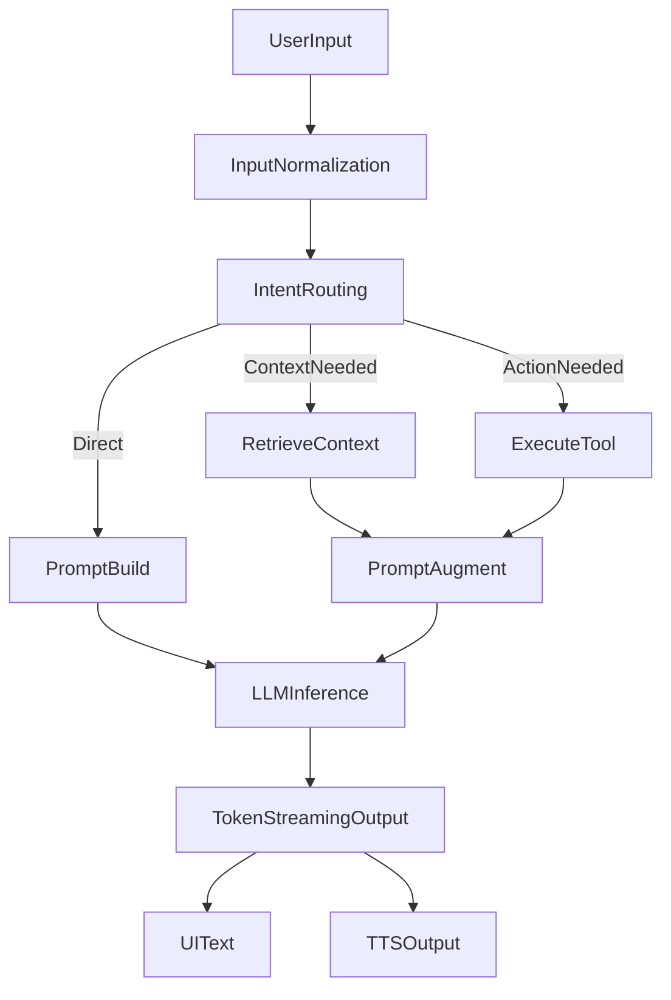

# Input Processing and Tooling Flow

This document defines how OfflineMate processes user input efficiently on-device.

## Core Processing Flow

## Why This Flow Was Chosen

- Avoids repeatedly sending full chat history.
- Separates routing, retrieval, and generation for performance control.
- Enables deterministic tool behavior in early versions.
- Keeps pipeline debuggable and testable in isolated modules.

## Input Modes

- Text input
- Voice input (STT before routing)
- Image input (future phase)

## Intent Routing Strategy

Early phase:

- Rule-based classification (keywords, command patterns)
- No extra LLM call for routing on weaker devices

Later phase:

- Optional LLM-assisted planner for multi-step task orchestration

## Tooling Design

- Tool registry with strict allow-list
- Schema-validated arguments for each tool
- Minimal output shape returned to prompt builder

Initial tool set:

- calendar read/create
- contacts search
- notes create/search
- reminders set

## References

- Expo Calendar: [https://docs.expo.dev/versions/latest/sdk/calendar/](https://docs.expo.dev/versions/latest/sdk/calendar/)
- Expo Contacts: [https://docs.expo.dev/versions/latest/sdk/contacts/](https://docs.expo.dev/versions/latest/sdk/contacts/)
- Expo Notifications: [https://docs.expo.dev/versions/latest/sdk/notifications/](https://docs.expo.dev/versions/latest/sdk/notifications/)
- React Native RAG concepts: [https://software-mansion-labs.github.io/react-native-rag/](https://software-mansion-labs.github.io/react-native-rag/)
