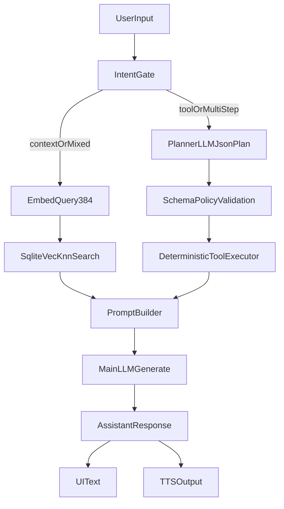

# Input Processing and Tooling Flow

This document defines how OfflineMate processes user input efficiently on-device.

## Core Processing Flow (Implemented)

## Why This Flow Was Chosen

- Separates intent gating, retrieval, planning, and generation for lower latency and better debuggability.
- Uses native vector KNN (`sqlite-vec`) to reduce JS-side scan overhead.
- Uses planner schema validation to avoid malformed tool execution.
- Preserves deterministic fallback paths when planner/vector capabilities are unavailable.

## Input Modes

- Text input
- Voice input (STT before routing)
- Image input (future phase)

## Intent Routing Strategy

Early phase:

- Rule-based classification (keywords, command patterns)
- No extra LLM call for routing on weaker devices

Current phase:

- LLM-assisted JSON planner for tool/multi-step flows
- deterministic validation + executor
- fallback deterministic plan when planner output is invalid

## Tooling Design

- Tool registry with strict allow-list
- Schema-validated arguments for each tool
- Minimal output shape returned to prompt builder

Initial tool set:

- calendar read/create
- contacts search
- notes create/search
- reminders set

## References

- Expo Calendar: [https://docs.expo.dev/versions/latest/sdk/calendar/](https://docs.expo.dev/versions/latest/sdk/calendar/)
- Expo Contacts: [https://docs.expo.dev/versions/latest/sdk/contacts/](https://docs.expo.dev/versions/latest/sdk/contacts/)
- Expo Notifications: [https://docs.expo.dev/versions/latest/sdk/notifications/](https://docs.expo.dev/versions/latest/sdk/notifications/)
- React Native RAG concepts: [https://software-mansion-labs.github.io/react-native-rag/](https://software-mansion-labs.github.io/react-native-rag/)
