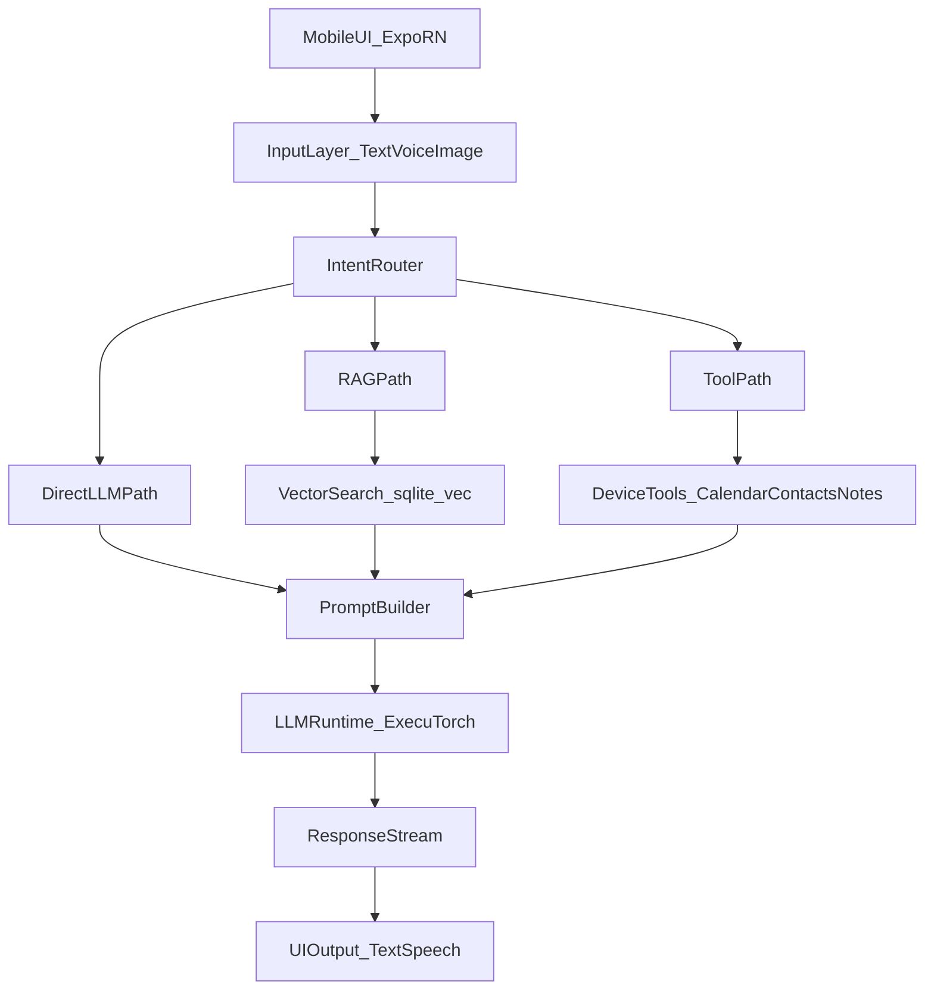

# Architecture Overview

OfflineMate is an offline-first mobile assistant built on Expo/React Native with on-device AI
inference, local retrieval, and local tool execution.

## Goals

- Full offline operation for core assistant tasks
- Privacy-first local data handling
- Broad device coverage using model tiers
- Production-ready deployment via Expo EAS

## System Topology

## Why This Architecture Was Chosen

- It keeps user data on-device by default.
- It scales from weak to strong phones via adaptive model tiers.
- It decouples context retrieval from chat history, improving quality and token efficiency.
- It allows staged delivery: basic chat first, then RAG, then speech and advanced tooling.
- It aligns with a production-proven pattern used by the Private Mind app stack.

## Key Architectural Decisions

- Framework: Expo + custom dev builds (not Expo Go)
- Runtime: ExecuTorch through `react-native-executorch`
- Memory/context: local vector retrieval with SQLite + `sqlite-vec`
- Speech: on-device STT and platform/native TTS path
- Tools: deterministic intent routing in early phases, optional LLM planner in later phase

## References

- React Native ExecuTorch docs: [https://docs.swmansion.com/react-native-executorch/docs](https://docs.swmansion.com/react-native-executorch/docs)
- React Native RAG: [https://software-mansion-labs.github.io/react-native-rag/](https://software-mansion-labs.github.io/react-native-rag/)
- Expo New Architecture: [https://docs.expo.dev/guides/new-architecture/](https://docs.expo.dev/guides/new-architecture/)
- Private Mind app listing: [https://apps.apple.com/au/app/private-mind/id6746713439](https://apps.apple.com/au/app/private-mind/id6746713439)
- Private Mind repository: [https://github.com/software-mansion-labs/private-mind](https://github.com/software-mansion-labs/private-mind)
