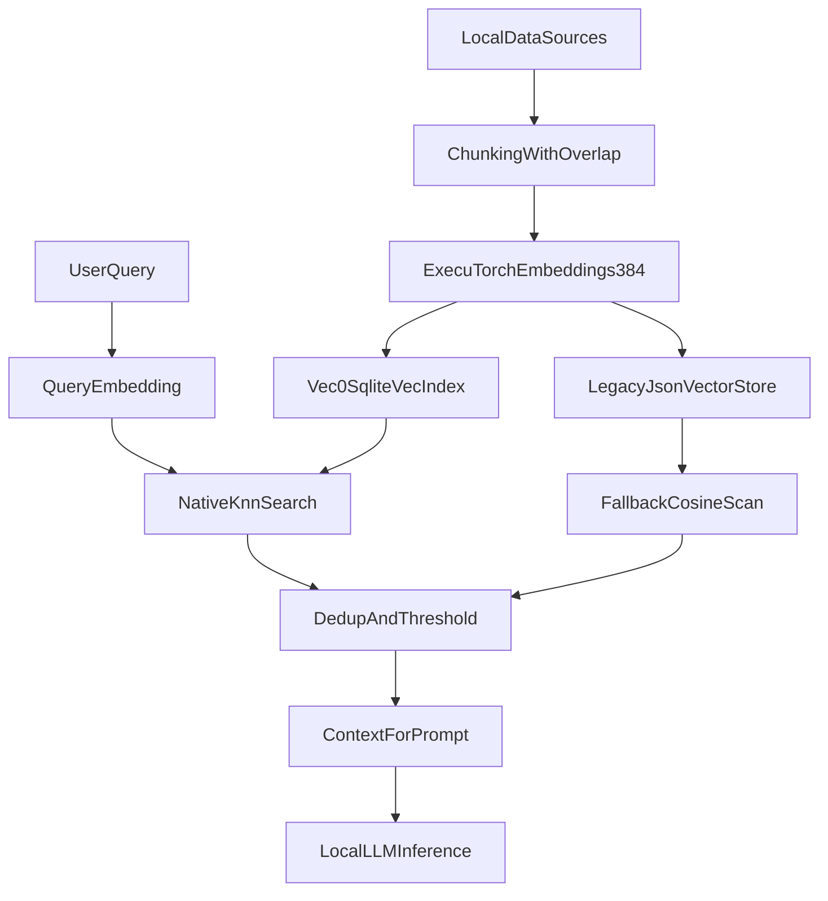

# RAG, Memory, and Vector Store Architecture

OfflineMate uses local retrieval to make responses context-aware without shipping user data to cloud APIs.

## Retrieval Architecture

## Why This Was Chosen

- Context retrieval scales better than full-history prompt replay.
- sqlite-vec KNN search reduces JS compute and memory overhead at query time.
- Fallback cosine scan path preserves reliability if vector extension is unavailable.
- Chunk-overlap indexing improves recall for long notes.

## Memory Strategy

- Conversation memory:
  - sliding window for recent turns
- Long-term memory:
  - extracted facts persisted as indexed notes
- Preference memory:
  - structured settings and profile metadata

## Indexing and Retrieval Rules

- Chunk source documents into bounded windows with overlap
- Store vectors in `vec0` index and legacy JSON-vector table
- Retrieve top-k + threshold + dedupe in query path
- Merge retrieval context with memory and tool output before prompt build

## Data Boundaries and Safety

- Keep retrieval corpus local only
- Track source origin for each chunk
- Apply sanitization to retrieved text before prompt injection
- Add guardrails for prompt injection from user-authored notes

## References

- Expo SQLite: [https://docs.expo.dev/versions/latest/sdk/sqlite/](https://docs.expo.dev/versions/latest/sdk/sqlite/)
- sqlite-vec project: [https://github.com/asg017/sqlite-vec](https://github.com/asg017/sqlite-vec)
- React Native RAG docs: [https://software-mansion-labs.github.io/react-native-rag/](https://software-mansion-labs.github.io/react-native-rag/)
- RAG concept paper: [https://arxiv.org/abs/2005.11401](https://arxiv.org/abs/2005.11401)
